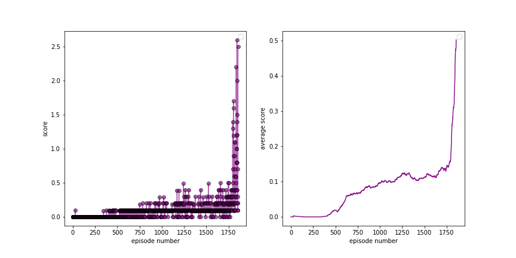
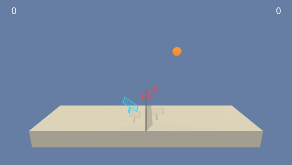

# Tennis Collab and Competetion Report
By: Stephen Hageman

## Intro
In this environment, two agents control rackets to bounce a ball over a net. If an agent hits the ball over the net, it receives a reward of +0.1.  If an agent lets a ball hit the ground or hits the ball out of bounds, it receives a reward of -0.01.  Thus, the goal of each agent is to keep the ball in play.

The observation space consists of 8 variables corresponding to the position and velocity of the ball and racket. Each agent receives its own, local observation.  Two continuous actions are available, corresponding to movement toward (or away from) the net, and jumping. 

The task is episodic, and in order to solve the environment, your agents must get an average score of +0.5 (over 100 consecutive episodes, after taking the maximum over both agents). Specifically,

- After each episode, we add up the rewards that each agent received (without discounting), to get a score for each agent. This yields 2 (potentially different) scores. We then take the maximum of these 2 scores.
- This yields a single **score** for each episode.

The environment is considered solved, when the average (over 100 episodes) of those **scores** is at least +0.5.

## Implementation

### Learning Algorithm

NOTE: the agent and model code is based on my previous project for this nanodegree ([see here](https://github.com/SJHageman/udacity-drl-ddpg)), and this was originally based on the ddpg-pendulum example from this course ([see here](https://github.com/udacity/deep-reinforcement-learning/tree/master/ddpg-pendulum)). This was modified to implement multiagent DDPG.

The algorithm that was selected for this project is Multi Agent Deep Deterministic Policy Gradient (MADDPG).  This is a generalization of the DDPG algorithm for using multiple agents in an environment. DDPG is an off-policy algorithm which can concurrently learn a policy and Q function, and it is suitable for solving tasks in a contiuous action space.  This method uses two neural networks, the actor and the critic networks. The actor network is used to determine the optimal actions given the current state, and the critic network is used to estimate the Q function. In MADDPG, a centralized critic architecure is used which has access to the experiences of both agents through a replay buffer, and this allows for more stable training.  For this competative environment, this allows for centralized training but decentralized actions based on the observations for each agent.

### Model and hyperparameters
The actor and the critic models have the following structure:

Actor:
* Linear linear layer with 33 features in, 256 features out
* Linear layer with 256 features in, 128 features out
* Linear layer with 128 features, 2 features out

Critic:
* Batch normalization
* Linear linear layer with 24 features in, 256 features out
* Linear layer with 258 features in, 128 features out
* Linear layer with 128 features, 1 feature out

The following hyperparameter were used:
* Random seed = 908
* Batch size = 256
* Max number of episodes = 5000
* Max buffer size = 1e5
* Discount fatcor (gamma) = 0.99
* Soft update tau = 5e-1
* lr_critic = 1e-4
* lr_actor = 1e-4
* weight_decay = 0
* Ornstein-Uhlenbeck mu = 0.0
* Ornstein-Uhlenbeck theta = 0.15 
* Ornstein-Uhlenbeck sigma = 0.2
                 
                
### Results: Plot of Rewards

Below are the results 

The plot on the left corresponds to the max score of the 2 agents, and the plot on the right is the average of those values over the past 100 episodes.  As can be seen, the environment was solved (average > 0.5) after 1857 episodes.  The key hyperparameter to solving this environment was actually the soft update parameter tau.  Typically this is a small value (like 1e-3), which corresponds to the target network getting updated more slowly.  This typically helps stabilize training.  However, in this case, a much larger value of tau (0.5) was actually needed to solve the environment.  This suggests that faster updates to the target network is better in this case.

### Results: View the action!
Below is a GIF of the trained agent and models in action: 

This taken by screen recording the Unity evironment using the Tennis_demo.ipynb notebook.

## Ideas for Future Work
This could be improved upon in many ways.  Firstly, hyperparameter tuning could be further performed to enhance the performance of the current algorithm.  Secondly, different algorithms could be used instead.  For example, multi agent PPO could potentially perform better than MADDPG for this task since it is generally less sensitive to hyperparameters and noise and therefore more stable. Prioritized replay buffer could also be implemented as an improvement, which prioritizes sampling from past experiences based on temporal-difference (TD) error.  Lastly, this environment seems to favor exploration, so other techniques to more quickly explore would be benefitial.